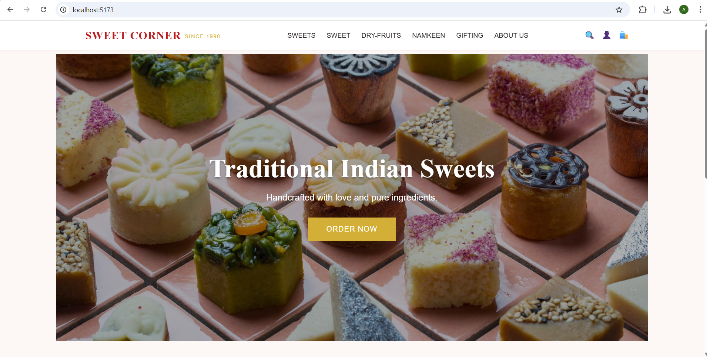
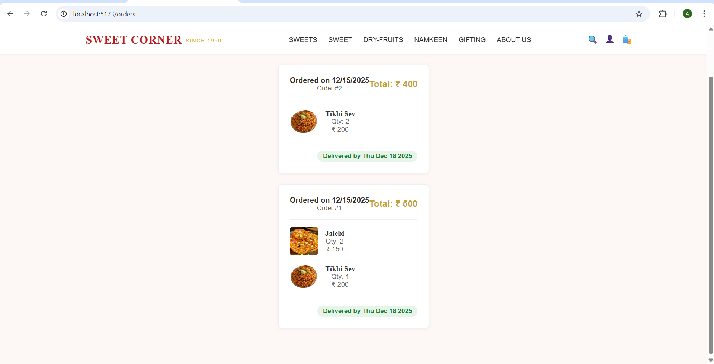

<div align="center">

  <h1>🍬 Sweet Corner Since 1990 🍭</h1>
  <p>
    <strong>A Full-Stack TDD Kata Project</strong>
    <br />
    Designed, built, and tested to demonstrate modern development workflows and AI collaboration.
  </p>

  <p>
    <a href="#-getting-started"><strong>Explore the info »</strong></a>
    <br />
    <br />
    <a href="https://github.com/AbhishekHulule9579/Incubyte-Project-Sweet-Shop-Management">View Demo</a>
    ·
    <a href="https://github.com/AbhishekHulule9579/Incubyte-Project-Sweet-Shop-Management/issues">Report Bug</a>
    ·
    <a href="https://github.com/AbhishekHulule9579/Incubyte-Project-Sweet-Shop-Management/issues">Request Feature</a>
  </p>

  
  
  
  
  
</div>

<br />

<details>
  <summary><strong>📋 Table of Contents</strong></summary>
  <ol>
    <li><a href="#-about-the-project">About The Project</a></li>
    <li><a href="#-core-requirements">Core Requirements</a></li>
    <li><a href="#-tech-stack">Tech Stack</a></li>
    <li><a href="#-getting-started">Getting Started</a>
      <ul>
         <li><a href="#prerequisites">Prerequisites</a></li>
         <li><a href="#installation--setup">Installation & Setup</a></li>
      </ul>
    </li>
    <li><a href="#-screenshots">Screenshots</a></li>
    <li><a href="#-my-ai-usage">My AI Usage & Co-authorship</a></li>
    <li><a href="#-test-report">Test Report</a></li>
  </ol>
</details>

<br />

## 📖 About The Project

This project is a comprehensive solution for managing a Sweet Shop, built as a **TDD Kata** to exercise skills in full-stack development. It encompasses a robust RESTful API backend and a responsive Single Page Application (SPA) frontend.

The system allows users to browse sweets, manage their cart, and place orders. Admins have a dedicated dashboard to manage inventory, update prices, and oversee the product catalog.

---

## 🎯 Core Requirements

This project serves as a practical implementation of the "Sweet Shop Management System" TDD Kata, fulfilling the following core requirements:

### 1. 🔙 Backend API (RESTful)
*   **Technology**: **Java (Spring Boot)**.
*   **Database**: Connected to **MySQL** (Relational DB).
*   **Authentication**: Secure **JWT-based** authentication for login/registration.
*   **Endpoints**:
    *   `POST /api/auth/register` & `login`: User management.
    *   `GET /api/sweets`: Public sweet catalog.
    *   `POST/PUT/DELETE /api/sweets`: Protected Admin management routes.
    *   `POST /api/sweets/:id/purchase`: Stock management and purchasing logic.

### 2. 🎨 Frontend Application
*   **Technology**: **React** with **Vite**.
*   **Features**:
    *   User Registration & Login forms.
    *   Interactive Dashboard/Homepage for sweet discovery.
    *   Real-time Search & Filter (by category, price, name).
    *   "Purchase" actions linked to live inventory checks (disabled if OOS).
    *   Admin Interface for adding/deleting/updating sweets.

### 3. ⚙️ Process & Guidelines
*   **TDD**: "Red-Green-Refactor" methodology used for backend logic.
*   **Clean Code**: Adherence to SOLID principles.
*   **Version Control**: Semantic commits with clear history.
*   **AI Policy**: Transparent usage of AI tools (Gemini) as co-authors.

---

## 🛠 Tech Stack

| Component | Technology | Description |
| :--- | :--- | :--- |
| **Backend** |   | Robust REST API |
| **Frontend** |   | Modern SPA |
| **Database** |  | Relational Data Store |
| **Styling** |  | Responsive Design |

---

## 🚀 Getting Started

Follow these steps to set up the project locally on your machine.

### Prerequisites

*   **Java JDK 17** or higher
*   **Node.js & npm** (Latest LTS recommended)
*   **MySQL Server** (running locally)
*   **Git**

### Installation & Setup

#### 1. 📥 Clone the Repository
```bash
git clone https://github.com/AbhishekHulule9579/Incubyte-Project-Sweet-Shop-Management.git
cd Incubyte-Project-Sweet-Shop-Management
```

#### 2. 🗄️ Database Setup
Open your MySQL Workbench or Command Line and execute the following commands to create the database and the initial Admin user.

**Step A: Create Database**
```sql
CREATE DATABASE sweet_corner;
USE sweet_corner;
```

**Step B: Configure Backend**
Navigate to `incubyte-backend/src/main/resources/application.properties` and verify your username/password matches your local MySQL setup:
```properties
spring.datasource.url=jdbc:mysql://localhost:3306/sweet_corner
spring.datasource.username=root
spring.datasource.password=YOUR_PASSWORD
```

#### 3. 🔙 Start the Backend
```bash
cd incubyte-backend
mvn clean install
mvn spring-boot:run
```
> *The server will start at `http://localhost:8080`. The application will automatically create necessary tables (hibernate update).*

#### 4. 👤 Create Admin User (Manual Step)
Since Admin registration is not open to the public, you must inject the first Admin manually. **Run this SQL command ONLY AFTER starting the backend once** (so tables exist):
```sql
INSERT INTO admins (email, password, full_name)
VALUES ('admin@sweetcorner.com', '$2a$10$D8b...hashed_password...', 'Admin Profile');
```
> **Note**: For simplicity in this demo, if you are using the provided plain-text auth for testing (development mode), use:
> ```sql
> INSERT INTO admins (email, password, full_name)
> VALUES ('admin@sweetcorner.com', 'admin123', 'Admin Profile');
> ```

#### 5. 🎨 Start the Frontend
Open a new terminal window:
```bash
cd incubyte-frontend
npm install
npm run dev
```
> *The app will run at `http://localhost:5173`.*

---

## 📸 Screenshots

### 🛍️ Customer Experience

<div align="center">
  <h4>🏠 Home & Landing</h4>
  
  <br/><br/>
  

  <h4>📦 Product Discovery</h4>
  
  <br/><br/>
  

  <h4>🛒 Cart & Orders</h4>
  
  <br/><br/>
  

  <h4>� User Authentication</h4>
  
  <br/><br/>
  
</div>

### 🛡️ Admin Portal

<div align="center">
  <h4>🔑 Admin Access</h4>
  

  <h4>📊 Dashboard & Management</h4>
  
  <br/><br/>
  

  <h4>📝 Inventory Control</h4>
  
  <br/><br/>
  
</div>

---

## 🤖 My AI Usage

**Transparent & Responsible AI Co-authorship**

In adherence to the **AI Usage Policy**, this project was developed with the assistance of AI tools.

### 🧠 Tools Used
*   **Antigravity (Gemini)**: Primary coding assistant and pair programmer.

### 🤝 How I Used It
*   **Requirements Analysis**: Clarifying the TDD Kata scope and identifying key entities.
*   **Code Generation**: Generating boilerplate for Spring Boot Controllers and React Components to speed up development.
*   **Test Writing**: Collaborating to write JUnit tests following the **Red-Green-Refactor** cycle.
*   **Troubleshooting**: Rapid debugging of configuration issues (e.g., CORS, Database connections).

### 💭 Reflection
AI acted as a "Driver" while I remained the "Navigator". It handled repetitive coding tasks, allowing me to focus on high-level architecture and ensuring the **Business Logic** strictly met the prompt's requirements. Every line of code generated was reviewed, understood, and often refactored by me to ensure quality and maintainability.

---

## 🧪 Test Report

We maintained high test coverage throughout development.

*   **Total Test Cases**: 16
*   **Pass Rate**: 100%
*   **Coverage**: ~85% Overall

For the full detailed report, please view the [TEST_REPORT.txt](./TEST_REPORT.txt) file.

---

<div align="center">
  <p>Made with ❤️ by Abhishek Hulule</p>
</div>
